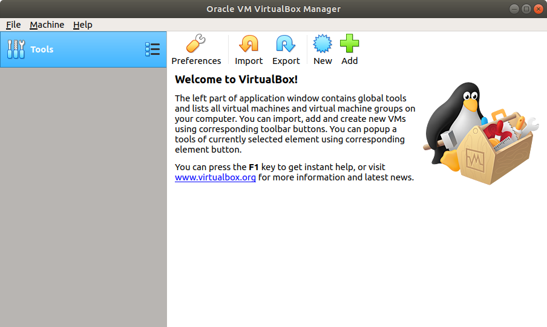

<h1>Installing Nunallit: </h1>

Nunaliit is an open source web mapping framework, designed for a Linux operating system (OS) and uses a number of open source software packages. However, this tutorial recognizes that most users are coming from a Windows OS background, and are not accustom to working with Linux.

This tutorial instructs how to install Nunaliit using a virtual machine, which is available to deploy in most OS environments, including; Windows, Mac OS or various Linux distributions. Using a virtual machine allows users to try Nunaliit without forcing them to completely abandon their OS of choice, creating a Linux partition, or needing to invest in a server to see Nunaliit’s potential as a free web mapping framework.

If you’re currently a Linux user and have Ubuntu installed on your desktop or server environment, you can skip <strong>steps 1</strong> and <strong>2</strong> and start on <strong>step 3</strong>. Note: Nunaliit officially supports being run on Ubuntu, but can also work on other distributions.

<h2>Step 1 - Download Linux distribution: </h2>

Before you can install a new Linux OS as a virtual machine, you will need to download a copy of the OS. For this exercise we will download the popular distribution Ubuntu, which can be downloaded from <a href="http://www.ubuntu.com/download">http://www.ubuntu.com/download</a>. Note: If you're familiar with Linux, you may want to download the server version of Ubuntu instead of the desktop version, if you have no need for a graphical user interface for your virtual machine.

When downloading the distribution, make sure it’s in an iso file format, and is supported by your hardware (note: if the 64 bit OS is not possible in VirtualBox, then you will likely need to use the 32 bit version of Ubuntu).

<h2>Step 2 - Creating a virtual machine with VirtualBox:</h2>
With a copy of Ubuntu downloaded, you will now create a virtual machine using the popular open source software VirtualBox.

<h3>Step 2.1 - Download VirtualBox:</h3>

First you will need to download VirtualBox, a free piece of software allowing you to create virtual machines within your own OS (i.e. you can run a copy of Ubuntu within Windows, MacOS or Linux environment). Go to <a href="https://www.virtualbox.org/">https://www.virtualbox.org/</a>, to download the software required for your computer, and install it on your system.

<h3>Step 2.2 - Create a new virtual machine:</h3>

Once successfully installed, run VirtualBox and click the <strong>New</strong> button.

<h3>Step 2.3 - Create a new virtual machine:</h3>

Provide the name of the OS and select the correct type and version. In our case it will be;

<ul>
<li>

Name: Ubuntu 16.04

</li>
<li>

Type: Linux

</li>
<li>

Version: Ubuntu (32bit) (Note: this may be 64 bit depending on Step 1)

</li>
</ul>

<h3>Step 2.4 - Define the memory size available for the virtual machine:</h3>

Note: A minimum of 2048 MB should be used for Ubuntu. (Note you can change this value afterwards through the settings. If you have memory to spare, providing more than 2048 MB is recommended for improved performance of Nunaliit)

<h3>Step 2.5 - Create a virtual hard disk:</h3>

Select ‘Create a virtual hard disk now’ and click <strong>Create</strong>.

<h3>Step 2.6 - Virtual disk type:</h3>

Select the hard disk file type: ‘VirtualBox disk image’, and then click <strong>Next</strong>.

<h3>Step 2.7 - Select dynamically allocated for the disk:</h3>

<h3>Step 2.8 - Set the file location and size:</h3>

Set the size of the virtual hard disk and the folder location. Make sure to provide enough space for the work you intended to do in the virtual environment.

<h3>Step 2.9 - Run the virtual machine:</h3>

Select the virtual machine you wish to run (if you only have one, it will automatically be selected). Under the Storage section click '<strong>[Optical Drive] Empty'</strong>, select the option '<strong>Choose disk image ...</strong>' and then select the Ubuntu iso file you downloaded in <strong>Step 1</strong>. Lastly click the <strong>Start</strong> button. Note: If you see an error message stating, ‘FATAL: No bootable medium found! System halted.’ This likely means you need to select the iso file you downloaded in <strong>Step 1</strong> to be booted.

<h3>Step 2.10 - Installing Ubuntu on the virtual machine:</h3>

After a couple minutes, an Ubuntu install window should pop up. Next, click the <strong>Install Ubuntu</strong> button.

Check both boxes on the preparing to install Ubuntu screen and click the<strong> Continue</strong> button

Select the option<strong> Erase disk and install Ubuntu</strong>, and then click the <strong>Install Now</strong> button.

You will then be asked to confirm you want to write these changes to disk, and you will need to click <strong>Continue</strong>.

Define where you are in the world (this will set your timezone/clock on the desktop) and then click <strong>Continue</strong>.

Define the keyboard layout, and click the <strong>Continue</strong> button.

Provide your user information for your user account in Ubuntu, and then click <strong>Continue</strong>. Make sure to remember your username and password (you will need these to log into the system after your installation and for downloading/installing new software).

When the installation is complete it will prompt you to restart your virtual machine. Click <strong>Restart Now.</strong>

Note: If the machine doesn’t restart automatically go to <strong>machine -> reset</strong>, or you can try closing the window and selecting the option '<strong>power off machine</strong>' if the virtual machine is unable to restart and then run it again.

Your virtual machine should now be up and running.

<h2>Step 3 - Installing Nunaliit prerequisites:</h2>

Now that Ubuntu is installed on your virtual machine and you have logged in with your Ubuntu username and password. Open the program called terminal (you can find it by clicking the window’s key or clover leaf key and type terminal into the search window)

<h3>Step 3.1 - Get the latest updates and upgrade software:</h3>

In the terminal, type the following commands:

<code>sudo apt-get update</code>

'sudo apt-get update' retrieves the latest list of software available via apt-get (Note: You will be prompted for your password when you type sudo for the first time. This is the same password as the one provided for your user account).

<code>sudo apt-get upgrade</code>

'sudo apt-get upgrade' downloads the latest software for your system. Next type <strong>Y</strong> to install the latest software updates.

<h3>Step 3.2 - Install Java on your system:</h3>
<code>sudo apt-get install -y openjdk-8-jre-headless</code>

<h3>Step 3.3 - Install Couchdb:</h3>
<code>sudo apt-get install -y couchdb</code>

<h3>Step 3.4 - Install FFMpeg:</h3>

<code>sudo apt-get install -y ffmpeg libav-tools ubuntu-restricted-extras libavcodec-extra</code>

<h3>Step 3.5 - Install ImageMagick:</h3>

<code>sudo apt-get install -y imagemagick</code>

<h2>Step 4 - Download the Nunaliit software development kit:</h2>

<a href="http://nunaliit.org" target="_blank" rel="noopener">Nunaliit</a> can be downloaed from the following <a href="http://central.maven.org/maven2/ca/carleton/gcrc/nunaliit2-couch-sdk/" target="_blank" rel="noopener">website</a>.

Pick the latest release (2.2.6 at the time of this instruction) and download the Nunaliit development kit (SDK) tar ball (e.g. <a href="http://central.maven.org/maven2/ca/carleton/gcrc/nunaliit2-couch-sdk/2.2.6/nunaliit2-couch-sdk-2.2.6-nunaliit.tar.gz">http://central.maven.org/maven2/ca/carleton/gcrc/nunaliit2-couch-sdk/2.2.6/nunaliit2-couch-sdk-2.2.6-nunaliit.tar.gz</a>). Note: v. 2.2.7 is now released.

Next you will need to uncompress/extract the tar-ball's files. You can either double click the file and uncompress/extract it to the desired directory using the graphical user interface, or you can uncompress/extract the files through the terminal (see command below).

<code>tar –xzvf nunallit2-couch-sdk-2.2.6-nunaliit.tar.gz</code>

<h2>Step 5 - Change CouchDB Admin Password:</h2>

Before you can run an atlas you will first need to add an admin account in CouchDB. Start by opening a browser by going to the following url: http://127.0.0.1:5984/_utils (CouchDB's futon page). Note: If CouchDB is installed by not running, you may need to start the service from the terminal, see this <a href="https://offnadir.wordpress.com/2016/11/18/quick-tip-start-couchdb-from-terminal/" target="_blank" rel="noopener">post</a> for instructions.

Click on the link ‘<strong>Fix this</strong>’, located at the bottom right-hand corner. Then in the create server admin window, add an admin password by typing admin into the username text field and then a password into the password field (Note: make sure to write this password down, you will need it to run Nunaliit).

<h2>Step 6 - Create a new Nunaliit Atlas:</h2>

You can create a new Nunaliit atlas using the following command in terminal. Note: make sure your current directory contains the extracted SDK sub-directory from the tar-ball:

<code>./nunaliit2-couch-sdk-2.2.6/bin/nunaliit create</code>

Provide the information for configuring a new atlas.

<ul>
<li>

Enter the name/location where the atlas will be created (keep the name lowercase and without spaces or special characters)

</li>
<li>

Note: many of the fields used for creating an atlas have default values (shown in [ ]), to accept these values simply hit enter/return.

</li>
<li>

Update the admin password to the new CouchDB admin password provided in <strong>Step 5</strong>.

</li>
<li>

See the screenshot of the create atlas configuration questions below;

</li>
</ul>

<h2>Step 7 – Update and Run a Nunaliit Atlas:</h2>

Once the atlas has been created, it will need to be updated first and then run. Start by changing the directory to the new atlas sub-directory, and then run the atlas update command as follows (Note: you may need to update the command below, if your copy of Nunaliit is located elsewhere):

<code>../nunaliit2-couch-sdk-2.2.6/bin/nunaliit update </code>

and then type the following to run the atlas:

<code>../nunaliit2-couch-sdk-2.2.6/bin/nunaliit run</code>

To see your atlas up and running go to the URL http://127.0.0.1:8080 (Note: replace the port 8080 with the port you provided in the initial create procedure if it’s different).

<h2>Step 8 – Stop a running atlas:</h2>

To stop the running atlas, type CTRL+C in the terminal

